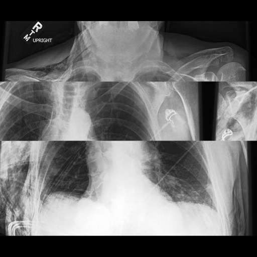
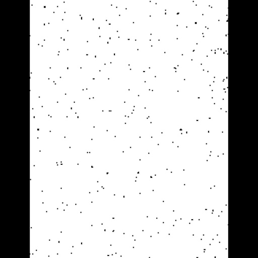
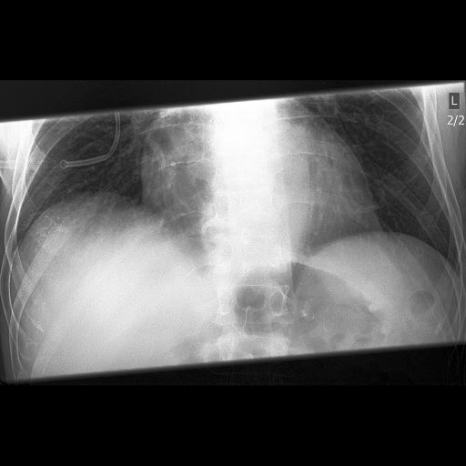
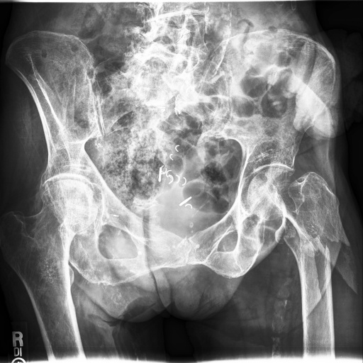
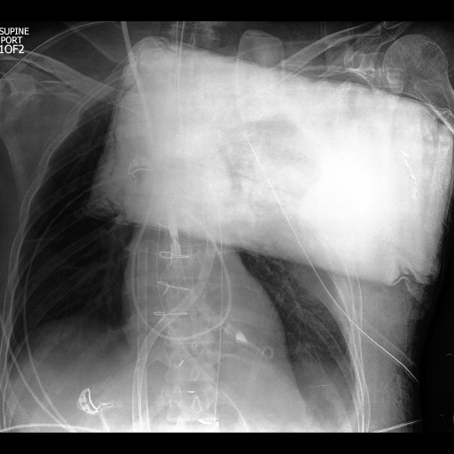
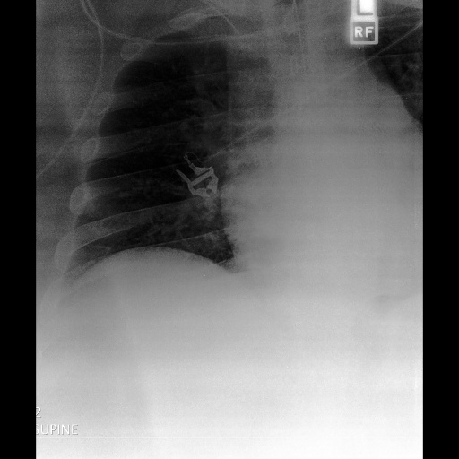

# CheXpert-review
Results of an amateur manual review of the CheXpert dataset (https://stanfordmlgroup.github.io/competitions/chexpert/)

Overall: 688 (0.3%) images were excluded and 155 (0.07%) images were edited.

train-ayhyap.csv contains the 'Path' column from the original train.csv, and 3 columns extra columns: exclude, edited and note.

* 'exclude' (1 or blank) indicates whether the image should be excluded.
* 'edited' (1 or blank) indicates whether the image should be edited.
* 'note' (string) indicates the reason for exclusion, or the edit required.

DISCLAIMER: I have no training in radiology. This was done from the perspective of a computer scientist.

# Exclusions

Count | Reason
------|-------
354 |incomplete
244 |striped
25 | corrupted
25 | obstructed
23 | poor
6 | non-cxr
4 | quantized
4 | posture

* Incomplete: The image contains under 60%-70% of the chest area. As labels are generated on a study-level, it is possible for the label to refer to an area outside of the image.
* Striped: The image contains a burst of rows has been shifted horizontally with wraparound. (there is actually more nuance to this, and fixing it is nontrivial)
* Corrupted: The image appears corrupted in some way.
* Obstructed: The image contains _abnormal_ obstructions.
* Poor: The image quality is poor and diagnosis is impossible.
* Non-CXR: The image is not a chest x-ray image at all. (mostly pelvic scans)
* Quantized: The image's pixel values have been quantized, reducing effective bit-depth and making diagnosis impossible.
* Posture: The patient's posture significantly complicates diagnosis. There were several patients with severe scoliosis (spine curved sideways) who could be excluded for this reason, but they have been left in.

# Edits

The edits are all rotations to correct the orientation of the image.

They are of format: (angle) CW rotation

Rotations are in multiples of 90 degrees, and always clockwise.

Note that only Frontal images have this field labeled, Lateral images were skipped.

Count | Rotation to fix (CW)
------|-------
69 | 90 degrees
61 | 180 degrees
25 | 270 degrees

 
# Samples

Sample | Note | Path
-------|------|-----
 | striped | CheXpert-v1.0/train=patient07083/study3/view1_frontal.jpg
 | corrupted | CheXpert-v1.0/train/patient05271/study5/view2_frontal.jpg
 | incomplete | CheXpert-v1.0/train/patient05129/study1/view1_frontal.jpg
 | non-cxr | CheXpert-v1.0/train/patient46319/study3/view1_frontal.jpg
 | obstructed | CheXpert-v1.0/train/patient05918/study6/view1_frontal.jpg
 | poor | CheXpert-v1.0=train/patient32307/study3/view1_frontal.jpg

# Comments

## Image Projection

There are 3 main projections of the images (not all images are labeled, and not all labeled images are correctly labeled)
* Anteroposterior (AP; x-rays shot front-to-back)
* Posteroanterior (PA; x-rays shot back-to-front)
* Lateral (LL; x-rays shot from the side)

Only in very, VERY rare circumstances should the heart appear on the left side of AP or PA images. This means mirroring image augmentation might not be appropriate.

Similarly, images are almost always oriented upright. This means rotational image augmentation should be limited to angles < 45 degrees.

## Patient Orientation

The patient can also be in different orientations (each have distinct appearances on the images and might be annotated on the image, but are not labeled in train.csv)
* Upright (best quality)
* Semi-upright (lower quality)
* Supine (lying down, back against bed; lower quality; usually AP)
* Decubitus (lying on side)

## Others

* Many imaging studies have multiple images which collectively capture the entire chest area, but do not do so individually. Since labels are generated on a study-level, this might introduce some labeling errors.
* Some patients have 60+ images. One could consider stratifying training epochs by patient to reduce bias towards patients with more images than others.
* X-Ray exposure is sometimes unevenly distributed across the image (e.g. bottom right much brighter than top left). I found using CLAHE with (2,2) tileGridSize (thus equalizing  the image by quadrants) to be effective in normalizing the uneven distribution. (https://docs.opencv.org/master/d5/daf/tutorial_py_histogram_equalization.html)
